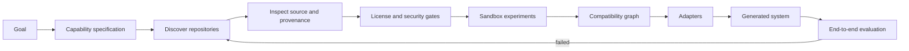

# Blackridge Systems

**Build from what already works. Write only what is missing.**

Blackridge Systems is an evidence-driven system foundry. It turns a desired outcome into
capabilities, discovers strong open-source implementations for each capability, verifies that
they are legally and technically usable, adapts their seams, and tests the resulting system.

The product rule is:

> **Reuse → inspect → verify → adapt → integrate → test → build only the gap.**

Implementation is experiment-first: freeze a falsifiable scenario, exercise the smallest real
vertical slice with positive and broken controls, inspect the artifacts, and only then expand the
code. Mocks and green CI protect regressions; they do not prove that a capability works.

Blackridge does not blindly merge repositories and does not treat GitHub stars as proof of
quality. Every candidate moves through explicit evidence levels before it may enter a generated
system.

## Current status

This repository contains an executable, manually reviewed vertical slice:

1. describe a system as capabilities with concrete acceptance scenarios;
2. search GitHub through the existing Octocode research engine;
3. enrich candidates with official GitHub metadata and OpenSSF Scorecard data;
4. apply license, maintenance, security, and adoption gates;
5. inspect real package versions and resolved dependency graphs through deps.dev;
6. separate raw probe evidence from named, explicit manual review;
7. build and exercise an exact public commit in disposable Docker through SWE-ReX;
8. adapt and validate JSON contracts with RFC 6902 and JSON Schema, including a broken control;
9. inspect an exact release independently with Syft, OSV-Scanner, Scorecard, deps.dev, GitHub,
   and PyPI Integrity;
10. freeze and calibrate an artifact-first A/B benchmark before either builder is run;
11. solve a linear compatibility graph, reject blocked or unreviewed choices, and generate a
    provenance-locked runnable system bundle;
12. audit source history and exact multi-line similarity against frozen upstream commits;
13. generate artifact-specific notices, package manifests, SBOMs, and license bundles;
14. fail closed on incomplete copy provenance and unresolved image-distribution obligations;
15. emit an auditable discovery run and a **provisional** system blueprint.
16. freeze the internal SWE-ReX runtime through a Debian snapshot, a 118-package OS lock, and
    hash-locked 35-distribution Python closure while prohibiting public image publication.
17. split sandbox preparation from production workload execution, detach every Docker network
    before workload argv runs, forward no host environment, and verify exact container cleanup.
18. copy hash-locked generated-system components into that boundary without host mounts and run
    contract validation and trusted adapters while production mode remains disabled.
19. run workloads as UID/GID 65534, enforce TERM-to-KILL deadlines inside the container, disable
    memory swap, and retain real filesystem, memory, PID, timeout, and signal hostile controls.

These probes produce evidence, not automatic approval. A candidate cannot be marked
production-ready until its concrete acceptance scenarios pass named manual review through L4.



## Quick start

Prerequisites: Python 3.11+, Node.js 20+, GitHub CLI authenticated with `gh auth login`, and
Git. Docker is recommended now and becomes required for sandbox validation.

```bash
python -m venv .venv
# Windows: .venv\Scripts\activate
# Linux/macOS: source .venv/bin/activate
python -m pip install -e ".[dev]"

blackridge doctor
blackridge discover examples/scientific-researcher.yaml --output .blackridge/research.json
blackridge report .blackridge/research.json
blackridge blueprint .blackridge/research.json --output .blackridge/blueprint.yaml

# A real package probe does not assign its own PASS/FAIL verdict.
blackridge probe-package pypi paper-qa --output .blackridge/evidence/paper-qa.json
blackridge review-probe examples/blackridge-self-hosting.yaml \
  .blackridge/evidence/paper-qa.json \
  --capability ecosystem-intelligence \
  --scenario paper-qa-package-evidence \
  --verdict pass \
  --reviewer "your-name" \
  --observed "Describe exactly what you inspected" \
  --notes "Explain why the evidence satisfies or fails the contract"
```

The discovery command invokes pinned upstream tooling as a subprocess with an argument vector,
never through an interpolated shell command. Remote repository code is not executed.

## Why this architecture

The difficult part is not finding popular repositories. It is proving that a precise component:

- implements the needed capability rather than merely claiming it;
- has a usable license and dependency chain;
- can be installed reproducibly;
- satisfies a stable input/output contract;
- works beside the other selected components;
- performs better than the alternatives on the user's actual workload.

Blackridge records those claims as evidence. Search results are only `L0 — discovered`; a
component needs at least `L2 — booted` before selection and `L4 — system verified` before a
system can be released.

## Upstream-first toolchain

Blackridge integrates tools at stable boundaries instead of copying their code:

| Stage | Selected upstream building block | Role |
| --- | --- | --- |
| discovery | Octocode + GitHub CLI/MCP | repository and code research |
| ecosystem intelligence | deps.dev | package versions, licenses, advisories, provenance, and resolved graphs |
| context | Repomix | bounded, reproducible repository snapshots |
| quality | OpenSSF Scorecard + OSV-Scanner/OSV-SCALIBR | posture and known vulnerabilities |
| compliance | OSS Review Toolkit + Syft | licenses, dependencies, and SBOMs |
| execution | SWE-ReX / Docker; OpenSandbox next | pinned disposable execution backend |
| experiments | Dagger | reproducible build and test DAGs |
| payload adaptation | JSON Patch + JSON Schema | declarative field mapping and contract evidence |
| adaptation | ast-grep / OpenRewrite | structural transforms instead of regex patches |
| missing code | OpenHands software-agent-sdk | write only adapters or genuinely missing modules |

Exact evaluated versions and integration status live in
[`upstream-catalog.yaml`](upstream-catalog.yaml). The landscape research and rejected options
are documented in [`docs/research-landscape.md`](docs/research-landscape.md).

The gated path from the foundry to a scientific researcher, AI-memory experiments, and an
evidence-controlled research loop is recorded in
[`docs/research-loop-roadmap.md`](docs/research-loop-roadmap.md). It is a roadmap, not a claim that
Blackridge already performs autonomous scientific discovery.

### Run a real disposable repository probe

Install the optional adapter, build the pinned runtime, and execute the retained public-repository
scenario:

```powershell
python -m pip install --editable ".[sandbox]"
docker build --tag blackridge/swerex-runtime:1.4.0 --file docker/swerex-runtime.Dockerfile .
blackridge probe-environment examples/sandbox-pypa-sampleproject.yaml `
  --output .blackridge/evidence/sampleproject.json
```

This uses SWE-ReX and Docker, resolves the built image to its immutable local ID, applies resource
and process restrictions, fetches one 40-character Git commit, retains every command result, hashes
the host source tree before and after, and verifies container removal. It deliberately emits no
approval verdict. The paired negative scenario is
[`examples/sandbox-pypa-sampleproject-negative.yaml`](examples/sandbox-pypa-sampleproject-negative.yaml).

The Docker backend has outbound network access and is not presented as a hardened multi-tenant
sandbox. No host path is mounted during this probe. OpenSandbox with a stronger isolation backend
and egress policy remains the production boundary.

### Inspect one exact release across the supply chain

Pull the immutable scanner images listed in the experiment, then retain full SBOM and vulnerability
artifacts next to the raw probe:

```powershell
docker pull anchore/syft@sha256:678bfa565b60f747aac0f8e964fe5588a24445b8d0a480e91f6efd70020dfbb0
docker pull ghcr.io/google/osv-scanner@sha256:8108ae94eadea5a02c9bec6e646909d5b790b44bd62d7f5b7f0b1d6d0ffc7734
python -m pip install -e ".[supply-chain]"
blackridge probe-supply-chain examples/supply-chain-paperqa.yaml `
  --work-root .blackridge/supply-chain/paperqa `
  --artifact-dir .blackridge/evidence/paperqa-artifacts `
  --output .blackridge/evidence/paperqa-supply-chain.json
```

The probe keeps repository and direct-dependency licensing, SBOM license coverage, Scorecard
posture, OSV findings, GitHub commit verification, and PyPI distribution provenance as separate
observations. OSV exit 1 is retained as a finding result. A missing source remains unknown.
The pinned `pypi-attestations` verifier distinguishes provenance availability from cryptographic
artifact/repository verification. PyPI provenance does not by itself bind the release to the exact
requested source commit, so that limitation remains explicit in the evidence.

### Calibrate the first A/B benchmark

```powershell
blackridge benchmark-calibrate `
  benchmarks/scientific-researcher-v1/evaluator/benchmark.yaml `
  benchmarks/scientific-researcher-v1/calibration-reference.yaml `
  benchmarks/scientific-researcher-v1/calibration-broken.yaml `
  --output .blackridge/evidence/benchmark-calibration.json
```

The evaluator reads candidate JSON from stdout rather than trusting exit code zero. It retains
individual critical checks and raw telemetry and deliberately emits no weighted success score.
The frozen two-arm procedure and contamination boundary are documented in
[`docs/benchmark-protocol.md`](docs/benchmark-protocol.md). Real baseline and Blackridge runs start
only after this harness is manually calibrated.

### Verify a component adapter and its negative control

```powershell
blackridge probe-adapter examples/adapter-paper-title-to-document-name.yaml `
  --output .blackridge/evidence/adapter.json
blackridge probe-composition examples/adapter-paper-title-to-document-name.yaml `
  examples/adapter-paper-title-broken.yaml `
  --output .blackridge/evidence/composition.json
```

The adapter is a reviewable RFC 6902 document, not generated Python. The pair command refuses to
compare different fixtures or schemas and retains both complete artifacts. In the supplied example,
both patches apply without an exception; JSON Schema validation is what detects the broken edge.

### Solve, generate, and execute a compatible system

```powershell
blackridge compose-solve examples/composition-linear-calibration.yaml `
  --output .blackridge/composition-plan.yaml
blackridge compose-generate examples/composition-linear-calibration.yaml `
  .blackridge/composition-plan.yaml .blackridge/generated-research
blackridge compose-run .blackridge/generated-research examples/composition-input.json `
  --provenance-sha256 <hash-printed-by-compose-generate> `
  --output .blackridge/composition-output.json `
  --evidence .blackridge/evidence/composition-run.json
```

The v1 solver uses hard gates, not a hidden weighted score. It checks allowed licenses and
integration modes, exact command and adapter hashes, evidence levels, named review hashes in
production mode, and a complete contract route. The generator writes component and evidence
locks, the exact definition and full plan, schemas, adapter definitions, a shell-free runtime,
provenance hashes, an SBOM gate, and an explicit `release_ready: false`. Host execution is
restricted to Blackridge-owned calibration fixtures; production components must run through a
sandbox in a later runtime backend.

The SHA-256 printed by `compose-generate` is an external trust root. Saved bundles cannot execute
by merely rewriting `runtime.yaml` and updating the hashes inside their own `provenance.json`;
`compose-run` and `compose-run-sandbox` require that independently retained digest.
Both runtimes retain failure evidence but publish the normal `--output` artifact only after every
step and output contract completes successfully. Host calibration also verifies every component
launch hash before executing the first step, so a known-bad later component cannot cause a partial
pipeline run.

### Audit source provenance and release artifacts

```powershell
blackridge probe-source-provenance provenance/source-audit.yaml `
  --output .blackridge/evidence/source-provenance.json
blackridge check-provenance provenance/derived-code.yaml
blackridge compliance-notices --check
blackridge probe-wheel-release dist/blackridge_systems-0.1.0-py3-none-any.whl
blackridge probe-image-release `
  blackridge/swerex-runtime@sha256:<exact-repository-digest>
```

The source scan combines Git first-add history with an exact normalized six-line comparison against
pinned upstream trees. It does not claim that zero exact matches proves originality. The copy gate
requires source and destination hashes, an immutable upstream commit, license text, compatibility
decision, attribution, modification notes, and a hash-locked named manual review.

The wheel and image are separate distribution surfaces. The image probe inventories the exact
digest, extracts Python and Debian license material, and remains blocked while corresponding-source
or other license obligations are unresolved. See
[`docs/release-compliance.md`](docs/release-compliance.md) and
[`docs/source-provenance-policy.md`](docs/source-provenance-policy.md).

## Repository map

```text
src/blackridge/           deterministic control plane and CLI
examples/                 capability specifications
tests/                    deterministic unit and integration regression tests
tools/system_e2e.py       installed-wheel host/Docker E2E and fail-closed controls used by CI
evidence/manual/          retained real-world probes and named manual verdicts
docs/                     architecture, research, and security decisions
upstream-catalog.yaml     pinned upstream choices and provenance
compliance/               active distribution manifest used to generate notices
provenance/               source-audit scope and fail-closed derived-code registry
docker/                   runtime Dockerfile and declared image component manifest
```

## Scope boundary

Blackridge is not yet a one-command autonomous software factory. Discovery, package and
exact-release supply-chain inspection, commit-pinned Docker experiments, declarative payload
adapters, paired negative contract verification, frozen benchmark calibration, linear
compatibility solving, locked generation, and calibration runtime execution now produce raw
evidence. The first isolated A/B attempts, production-scope dependency classification,
multi-input/DAG solving, production sandbox execution, adapter synthesis beyond JSON Patch,
hardened remote isolation through OpenSandbox, and L4 delivery are next.

## License

Apache-2.0. Upstream components retain their own licenses and are not vendored into this
repository.
