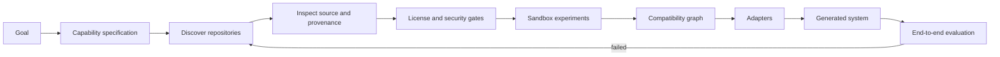

# Blackridge Systems

**Build from what already works. Write only what is missing.**

Blackridge Systems is an evidence-driven system foundry. It turns a desired outcome into
capabilities, discovers strong open-source implementations for each capability, verifies that
they are legally and technically usable, adapts their seams, and tests the resulting system.

The product rule is:

> **Reuse → inspect → verify → adapt → integrate → test → build only the gap.**

Blackridge does not blindly merge repositories and does not treat GitHub stars as proof of
quality. Every candidate moves through explicit evidence levels before it may enter a generated
system.

## Current status

This repository contains the first executable vertical slice:

1. describe a system as a capability specification;
2. search GitHub through the existing Octocode research engine;
3. enrich candidates with official GitHub metadata and OpenSSF Scorecard data;
4. apply license, maintenance, security, and adoption gates;
5. emit an auditable discovery run and a **provisional** system blueprint.

The current release deliberately stops before executing untrusted code. A candidate cannot be
marked production-ready until it boots in a sandbox and passes contract and end-to-end tests.



## Quick start

Prerequisites: Python 3.11+, Node.js 20+, GitHub CLI authenticated with `gh auth login`, and
Git. Docker is recommended now and becomes required for sandbox validation.

```bash
python -m venv .venv
# Windows: .venv\Scripts\activate
# Linux/macOS: source .venv/bin/activate
python -m pip install -e ".[dev]"

blackridge doctor
blackridge discover examples/scientific-researcher.yaml --output .blackridge/research.json
blackridge report .blackridge/research.json
blackridge blueprint .blackridge/research.json --output .blackridge/blueprint.yaml
```

The discovery command invokes pinned upstream tooling as a subprocess with an argument vector,
never through an interpolated shell command. Remote repository code is not executed.

## Why this architecture

The difficult part is not finding popular repositories. It is proving that a precise component:

- implements the needed capability rather than merely claiming it;
- has a usable license and dependency chain;
- can be installed reproducibly;
- satisfies a stable input/output contract;
- works beside the other selected components;
- performs better than the alternatives on the user's actual workload.

Blackridge records those claims as evidence. Search results are only `L0 — discovered`; a
component needs at least `L2 — booted` before selection and `L4 — system verified` before a
system can be released.

## Upstream-first toolchain

Blackridge integrates tools at stable boundaries instead of copying their code:

| Stage | Selected upstream building block | Role |
| --- | --- | --- |
| discovery | Octocode + GitHub CLI/MCP | repository and code research |
| context | Repomix | bounded, reproducible repository snapshots |
| quality | OpenSSF Scorecard + OSV-SCALIBR | security posture and vulnerabilities |
| compliance | OSS Review Toolkit + Syft | licenses, dependencies, and SBOMs |
| execution | OpenSandbox / SWE-ReX | isolated, replaceable execution backends |
| experiments | Dagger | reproducible build and test DAGs |
| adaptation | ast-grep / OpenRewrite | structural transforms instead of regex patches |
| missing code | OpenHands software-agent-sdk | write only adapters or genuinely missing modules |

Exact evaluated versions and integration status live in
[`upstream-catalog.yaml`](upstream-catalog.yaml). The landscape research and rejected options
are documented in [`docs/research-landscape.md`](docs/research-landscape.md).

## Repository map

```text
src/blackridge/           deterministic control plane and CLI
examples/                 capability specifications
tests/                    unit tests with mocked external tools
docs/                     architecture, research, and security decisions
upstream-catalog.yaml     pinned upstream choices and provenance
```

## Scope boundary

Blackridge is not yet a one-command autonomous software factory. The first milestone is an
honest, testable selection engine. Automatic sandbox experiments, compatibility matrices,
adapter synthesis, and full generated-system delivery are the next milestones described in the
architecture document.

## License

Apache-2.0. Upstream components retain their own licenses and are not vendored into this
repository.

