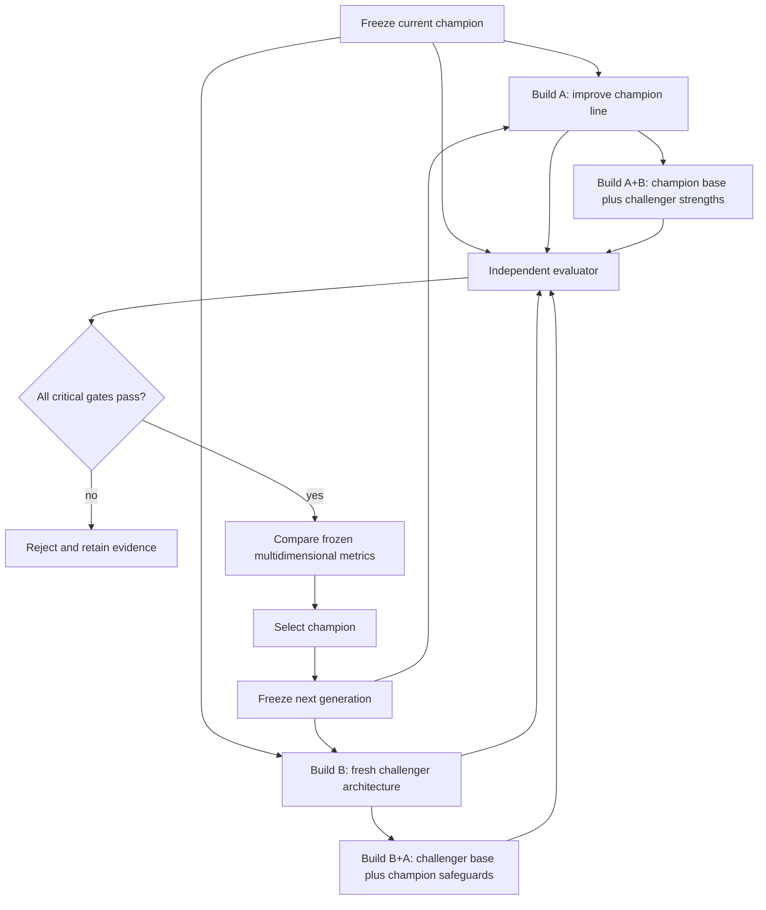

# Champion–challenger evolution loop

Architectural names describe lineage, not releases. Package versions remain separate metadata.
The current champion is `v1.1`; the name `v2` is reserved for a fresh alternative architecture.

## One round

1. Freeze the current champion and its complete benchmark inputs.
2. Build `A`, a further development of the champion line.
3. Build `B`, a genuinely different architecture without champion source as builder context.
4. Identify component-level strengths and weaknesses from retained evidence.
5. Build `A+B` and `B+A` with explicit transfer provenance.
6. Run the champion and all four candidates on the exact same public benchmark revision and
   evaluator-only holdout revision.
7. Reject data loss, security, licensing, provenance, benchmark-integrity, reproducibility, or
   functional-minimum failures before scoring.
8. Compare eligible candidates with frozen metrics. Fewer manual interventions break equal-score
   ties; an exact remaining tie retains the incumbent to avoid architectural churn.
9. Freeze the winner, every failure, builder identity, evaluator identity, hashes, costs, times,
   and transfer lineage.
10. Start the next round from the selected champion, regardless of its original line number.

Before code is built, an architecture proposal must pass both deterministic schema checks and an
independent semantic review. Schema validity proves only that the graph is parseable. It does not
prove ordering, trust, evidence completeness, executable vertical slices, or benchmark fitness.
Rejected completions and reviews are retained as round evidence.

A deterministic repair may add a flow contract to an already-declared component interface when
the exact rejected completion hash is approved. It may not invent components, flows, trust zones,
responsibilities, claims, or safeguards. The derived proposal gets a new SHA-256 and still requires
manual review; mechanical repair can never promote a candidate.

## Separation of authority

The builder may write a candidate and candidate-owned tests. It may not change the frozen
benchmark, evaluator, holdout hash, critical gates, metric bounds, weights, or winner. The evaluator
must have a different identity from every builder. Candidate tests are diagnostic only; promotion
requires evaluator-owned evidence.

## Metric order

Critical gates run first. Eligible candidates are then compared across effectiveness, final-system
quality, actual reuse, security, license/provenance quality, autonomy, manual interventions, cost,
duration, maintainability, and complexity/debt. Metric direction, bounds, and weight are frozen
before builders start. A single overall score is never allowed to rescue a failed critical gate.

## Snapshot rule

Development may continue between rounds, but every candidate is immutable during one comparison.
Every observation binds to the candidate artifact SHA-256, public benchmark SHA-256, hidden holdout
SHA-256, and evidence SHA-256. Changing code or a workload creates a new candidate or benchmark
revision; it never rewrites an existing result.
