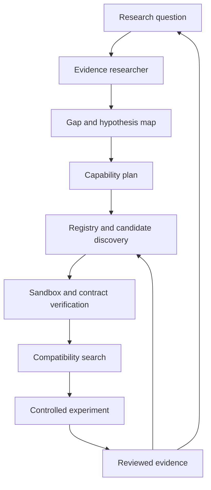

# Research and experiment loop roadmap

Status: accepted direction, gated roadmap — not a current product claim.

## Decision

Blackridge should first become a reliable system foundry and then use a scientific researcher as
its first demanding client. If that succeeds, the researcher and the foundry can share an
evidence-backed component registry and support controlled experiments on AI memory systems.

The valuable claim is deliberately narrower than "find the globally best architecture":

> With the same model, requirements, budget, and evaluator, Blackridge should increase task
> success or reach the same success with less new code, time, cost, or repair effort by finding and
> composing verified existing components.

This claim must be earned by repeated A/B experiments. Market impact, percentage success
predictions, and autonomous scientific discovery are hypotheses, not roadmap acceptance criteria.

## Experiment before expansion

Blackridge must test its riskiest assumption before building the surrounding platform. Every new
capability, integration, solver strategy, or research mechanism starts as the smallest vertical
slice that can falsify a written hypothesis on a real component and representative input.

The mandatory order is:

```text
hypothesis and failure condition
    -> frozen real scenario and baseline
    -> smallest executable integration
    -> positive and deliberately broken control
    -> raw artifact inspection and named verdict
    -> continue, change direction, or stop
```

Code may expand only after the experiment produces the expected observable behavior. If the result
is failed, blocked, unstable, or ambiguous, Blackridge retains it and resolves the uncertainty
before adding abstractions around it. A feature backed only by mocks, unit tests, generated prose,
or a successful exit code remains **NOT RUN** as a product capability.

Before generalizing a mechanism, exercise it against at least two meaningfully different real
subjects. Before promoting a complete system, run its frozen end-to-end workload in a clean
environment. This is the defense against writing a large framework whose central assumption was
never tested.

## Why this direction is worth pursuing

The plan joins three assets that reinforce one another:

1. Blackridge discovers, verifies, and composes reusable software capabilities.
2. A scientific researcher finds papers, implementations, contradictions, and research gaps.
3. An experiment harness compares memory mechanisms and their combinations under frozen controls.

Their shared long-term asset is a **Verified Component Registry**: an empirical record of what an
exact component version actually did, under which conditions, with which neighbors, and with what
evidence. This is more defensible than a search index or a collection of README summaries.



The loop may propose and test combinations. It must not promote a claim, component, or system
because an LLM described it persuasively or because a command exited successfully.

## Initial scope

Start with Python-based scientific-research and AI-memory tooling whose behavior can be evaluated
with deterministic contracts and retained artifacts.

In scope:

- paper and repository discovery;
- bibliographic metadata and immutable source identity;
- PDF/text extraction with source locators;
- claim, evidence, contradiction, and uncertainty records;
- retrieval, reranking, consolidation, temporal decay, importance scoring, episodic memory, and
  graph-memory components;
- reproducible software experiments, baselines, ablations, and compatibility tests;
- CLI, API, MCP, package, and OCI-image integration behind explicit contracts.

Initially out of scope:

- arbitrary software in every language and runtime;
- claims of global architectural optimality;
- autonomous acceptance of scientific conclusions;
- clinical, legal, physical, or other high-stakes experiments without domain governance;
- uncontrolled self-modification or automatic deployment of a newly discovered architecture.

## Build sequence and promotion gates

### Stage 0 — finish the foundry boundary

Before starting the research loop:

- keep the v1 runtime image internal-only; resolve its reciprocal-license and complete-source
  blockers before any future public image publication;
- execute production components in a hardened sandbox with explicit egress and secret policies;
- replace the calibration-only linear runtime with sandbox-backed production execution;
- support multi-input capability graphs and retain every solver decision;
- preserve exact environment, provenance, license, SBOM, and manual-review artifacts.

Promotion gate: one generated non-fixture system reaches L4 through a clean rebuild and independent
manual acceptance review. A green unit-test suite is not sufficient.

### Stage 1 — Verified Component Registry v1

Build an append-only registry from evidence Blackridge already emits. A record identifies an exact
version or immutable revision, never just a project name.

Each record must include:

- capability contract and stable integration boundary;
- source, revision, artifact hashes, license decision, and distribution obligations;
- evidence level plus the raw probe and named-review hashes that justify it;
- installation and health probes, runtime requirements, secrets, network, CPU, memory, and timing;
- accepted and produced contracts;
- tested compatibility and incompatibility edges;
- adapter identity, source, tests, and maintenance owner;
- known failures and negative evidence, not only successful runs;
- observation time, upstream freshness, and revalidation trigger.

Promotion gate: Blackridge can reconstruct why a component was selected, reproduce its probe from
an empty environment, detect stale evidence after an upstream change, and refuse a deliberately
incomplete registry entry.

### Stage 2 — scientific researcher v1

Use the existing `scientific-researcher-v1` benchmark. The researcher should produce traceable
records rather than prose alone:

- normalized paper/repository identity;
- claims tied to exact source locations;
- supporting, conflicting, and insufficient evidence;
- implementation links tied to immutable revisions where possible;
- explicit unknowns and abstention when the corpus is insufficient;
- a reproducible evidence graph and final synthesis derived from it.

Run the frozen `from-scratch` versus `blackridge-hybrid` protocol with the same model, budget,
tools, secrets, and evaluator. First run one smoke pair, then three fresh attempts per method, then
the broader multi-task study already defined in
[`benchmark-protocol.md`](benchmark-protocol.md).

Promotion gate: all benchmark controls remain calibrated and contamination-free; a named reviewer
can trace every accepted conclusion to retained evidence; repeated A/B results show either higher
task success or equal task success with a meaningful measured reduction in another raw metric.

### Stage 3 — memory experiment harness

Add experiments only after the researcher reliably constructs evidence maps. Every experiment
must freeze before execution:

- question and falsifiable hypothesis;
- dataset and immutable split hashes;
- baseline, component variants, and ablation matrix;
- task metrics and failure criteria;
- seeds, repetitions, model/version, prompts, budgets, hardware, and environment;
- allowed repair policy and stopping rule;
- expected artifacts and independent evaluation procedure.

The first experiments should compare one mechanism at a time, then small combinations such as
retrieval plus consolidation or retrieval plus temporal scoring. Do not begin with an unrestricted
architecture search.

Promotion gate: a known-good control passes, a green-exit broken control fails, repeated runs expose
variance, and an independent rerun can reproduce or explicitly fail to reproduce the result.

### Stage 4 — bounded composition search

For each required capability, discover several candidates and eliminate impossible combinations
before execution.

Hard rejection examples:

- incompatible or unresolved license obligations;
- unavailable runtime, missing immutable revision, or prohibited network/secrets;
- unresolved dependency conflict;
- missing route between required contracts;
- insufficient evidence level for the requested deployment mode.

Ranking evidence may include measured functional fit, existing verified adapters, latency,
resource use, reliability, installation cost, and observed compatibility. Search should begin with
a deterministic bounded strategy over the most promising candidates. Only surviving combinations
receive pairwise probes and end-to-end experiments.

Promotion gate: the solver explains every prune and selection, can reproduce the winning plan, and
beats simple controls such as "top repository per capability" or random compatible selection on
frozen workloads.

### Stage 5 — governed research loop

Connect the researcher, registry, composer, and experiment harness:

```text
question -> evidence map -> explicit gap -> hypothesis -> candidate composition
         -> preregistered experiment -> reviewed result -> registry update
```

Human approval remains required to accept a new scientific conclusion, promote evidence, change a
benchmark, introduce a new secret or network boundary, or publish a system. A failed or ambiguous
experiment is retained as useful negative evidence.

Promotion gate: the loop proposes a non-trivial combination, records why it was selected, tests it
against baselines and ablations, survives an independent rerun, and improves the next search
without changing prior evidence or evaluator rules.

## Measurement rules

Never report one opaque "Blackridge score". Preserve at least:

- critical acceptance checks and task success rate;
- wall time, model usage, monetary cost, and repair count;
- generated, adapted, and reused code with the counting method;
- clean-install and reproducible-rebuild results;
- component probe success, pairwise edge success, and end-to-end success;
- evidence coverage, unsupported-claim rate, contradiction handling, and abstention behavior;
- experiment variance and failed replications;
- registry reuse rate, staleness, revalidation cost, and upstream breakage rate.

Compare the same task under the same controls. A result from one benchmark or one lucky run is not
evidence of general market advantage.

## Stop or narrow the plan when

The project should narrow its target domain rather than hide negative evidence if repeated
experiments show that:

- registry upkeep costs as much as fresh discovery;
- adapters dominate the system and effectively recreate components from scratch;
- components pass isolated probes but routinely fail end-to-end;
- Blackridge does not improve success, cost, time, repair effort, or generated-code volume over the
  controlled baseline;
- results depend on evaluator leakage, manual rescue, or changing the task after seeing failures;
- upstream churn makes evidence stale faster than it can be revalidated.

Success in a bounded domain such as research pipelines or AI-memory experiments is enough. The
roadmap does not require universal software composition to be valuable.

## Immediate order after the current compliance work

1. Preserve the locked v1 runtime as internal-only; do not publish it while the two recorded public
   distribution blockers remain.
2. Keep the generated-system sandbox backend calibration-only. Non-root filesystem, timeout,
   signal, memory, and PID hostile controls now pass; next require read-only-root/scratch and
   disk-exhaustion controls before evaluating production enablement.
3. Run the already frozen scientific-researcher smoke A/B without changing its hidden evaluator.
4. Define Registry v1 from the existing evidence formats; do not create a parallel truth store.
5. Ingest only reviewed Blackridge evidence and test invalid, stale, and conflicting records.
6. Use researcher findings to choose the first small AI-memory benchmark and preregister its
   baselines and ablations before testing candidate combinations.

This order keeps the ambitious loop downstream of evidence quality. Blackridge may eventually help
improve its own components, but self-improvement remains a reviewed release process, not an
automatic permission to rewrite or deploy itself.

The first production-boundary experiment is retained in the 2026-08-27 manual evidence. It proves
network detachment, absent host-secret names, shell-free workload execution, paired unisolated
detection, host integrity, and cleanup for one exact repository. Its remaining limitations are
documented in [`production-sandbox-boundary.md`](production-sandbox-boundary.md).
